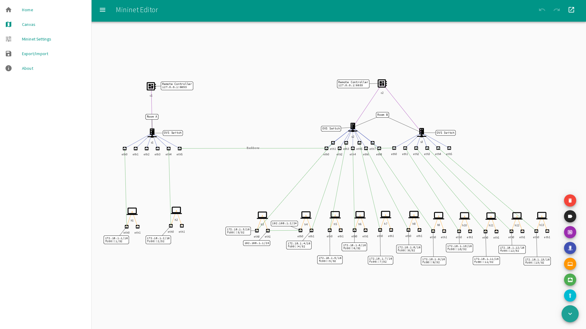

# Awesome vis.js
> A curated list around vis.js

**Feel free to add to the list!!**. If you think this is helpful **Please give a Star ★**.

## Resources

- https://www.visjs.org
- [visjs@npm](https://www.npmjs.com/org/visjs)

### CDNs

- [vis.js via cdnjs](https://cdnjs.com/libraries/vis)
- [vis.js via unpkg](https://unpkg.com/vis)

### Documentation & Help

- [vis-data documentation](https://visjs.github.io/vis-data/)
- [StackOverflow - vis.js questions & answers](https://stackoverflow.com/questions/tagged/vis.js)

## Libraries

- [vis-network](https://github.com/visjs/vis-network) - Display dynamic, automatically organised, customizable network views.
- [vis-timeline](https://github.com/visjs/vis-timeline) - Create a fully customizable, interactive timelines and 2d-graphs with items and ranges.
- [vis-graph3d](https://github.com/visjs/vis-graph3d) - Create interactive, animated 3d graphs. Surfaces, lines, dots and block styling out of the box.
- [vis-data](https://github.com/visjs/vis-data) - Manage unstructured data using DataSet. Add, update, and remove data, and listen for changes in the data.

### vis.js based libraries

#### Add-Ons
- [timeline-arrows](https://github.com/javdome/timeline-arrows) - Class to easily draw lines to connect items in the vis Timeline module.     

#### Vue
- [vue-visjs](https://www.npmjs.com/package/vue-visjs) - Vue2 component that helps with Visjs interaction.
- [vue-vis-network](https://github.com/r3code/vue-vis-network) - Integrate vis Network module to your Vue 2 application do draw network diagrams.
- [vue2vis](https://www.npmjs.com/package/vue2vis) - Vue2 component that helps with Visjs interaction [Deprecated]

#### React
- [react-graph3d-vis](https://github.com/auquan/react-graph3d-vis) - A react component to create interactive 3d graphs.
- [react-graph-vis](https://github.com/crubier/react-graph-vis) - A react component to render NETWORK graphs.

#### AngularJS
- [angular-visjs](https://github.com/visjs/angular-visjs) - AngularJS directive module for vis.js components.

#### Angular
- [timeline-dep-graph](https://github.com/SarAhmed/timeline-dep-graph) - Interavtive Angular-based library to visualize tasks’ hierarchies and dependencies.
- [ngx-vis](https://github.com/visjs/ngx-vis) - An angular 5+ vis.js project.

#### Misc
- [vis.js Drupal integration](https://www.drupal.org/project/visjs)
- [vaadin vis.js component](https://vaadin.com/directory/component/visjs-vaadin-component)
- [CHAP Links](https://almende.github.io/chap-links-library/) - The vis.js predecessor library.
- [bespoke-vis](https://www.npmjs.com/package/bespoke-vis) - Use visjs to include timelines in your bespoke.js presentation.
- [visNetwork](https://github.com/datastorm-open/visNetwork) - R package, using vis.js library for network visualization
- [neovis.js](https://github.com/neo4j-contrib/neovis.js) - Graph visualizations powered by vis.js with data from Neo4j.

### Blogposts & Tutorials

- [2018-08-19, vis.js Network Examples](https://www.thetaranights.com/visjs-network-examples/)
- [2018-04-18, Graph Visualization With Neo4j Using Neovis.js](https://medium.com/neo4j/graph-visualization-with-neo4j-using-neovis-js-a2ecaaa7c379)
- [2014-09-14, vis.js - based on JavaScript dynamic visualization library browser](https://www.programering.com/a/MTN2YDNwATI.html)
- [2014-05-26, Creating Network Diagrams With vis.js](https://appendto.com/2017/05/creating-network-diagrams-vis-js/)

### Misc

- [@visjs twitter account](https://twitter.com/visjs) [Not updated anymore]

### Alternatives

#### Timeline

- [Ruimdetijd/timeline](https://github.com/Ruimdetijd/timeline) - Slime timeline component
- [KronoGraph](https://cambridge-intelligence.com/kronograph/features/) - Commercial tool by CambridgeIntelligence.

#### Network

- [sigmajs.org](http://sigmajs.org/)
- [amcharts force-directed-network](https://www.amcharts.com/demos/force-directed-network/)
- [js.cytoscape.org](http://js.cytoscape.org/)
- [jsnetworkx.org](http://jsnetworkx.org/)

## Showcases

### Timeline

- https://agyletime.com/

### Network

- [Plunker - vis.js HTML overlay demo](https://embed.plnkr.co/dznE73/)

#### Star Citizen Route Planner

https://starcitizen.center/route-planner

This interactive route planner and map for the SciFi Universe StarCitize makes use of graph features such as physics enabled on links, manual persistent positions for the nodes (user can make custom layouts), and custom icons based on the logic.

#### Mininet Editor

https://thomaash.github.io/me/

SDN topology editor in your web browser with Mininet, image and addressing plan export.

#### Skyebridge

https://github.com/emsk/skyebridge

Flow diagram generator

## Misc

### Contributing
See the [Contribution Guide](CONTRIBUTING.md) for details on how to contribute.

### Code of Conduct
See the [Code of Conduct](CODE-OF-CONDUCT.md) for details. Basically, it comes down to:
> In the interest of fostering an open and welcoming environment, we as
contributors and maintainers pledge to making participation in our project and
our community a harassment-free experience for everyone, regardless of age, body
size, disability, ethnicity, gender identity and expression, level of experience,
nationality, personal appearance, race, religion, or sexual identity and orientation.

### License

This work is licensed under a [Creative Commons Attribution-ShareAlike 4.0 International License](https://creativecommons.org/licenses/by-sa/4.0/).
License holders are [all contributors](http://github.com/visjs/awesome-visjs/graphs/contributors).
